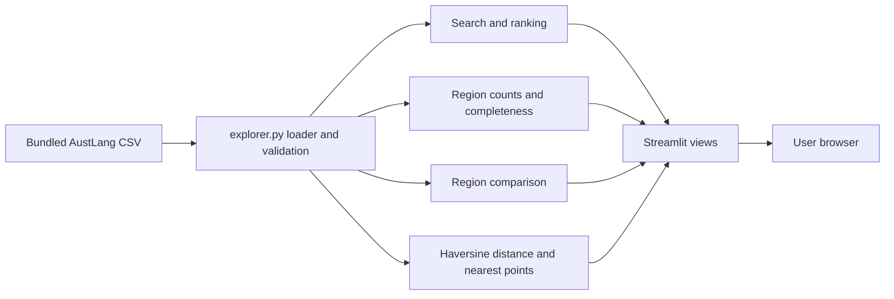

# AustLang Explorer

An interactive Python app for exploring published AIATSIS AustLang metadata. Built for the CITS1501 Culture, Country and Language project. It has five views: Search Languages, Language Map, Dataset Statistics, Compare Regions, and About the Data.

## Run in VS Code

1. Open this folder in VS Code.
2. In its terminal, create a virtual environment: `python3 -m venv .venv`.
3. Activate it: `source .venv/bin/activate` on macOS, or `.venv\\Scripts\\activate` on Windows.
4. Install packages: `python -m pip install -r requirements.txt`.
5. Start the app: `python -m streamlit run app.py`.

Streamlit prints a local URL, usually `http://localhost:8501`.

After the first setup, VS Code also provides **Terminal → Run Task → Run AustLang Explorer**. Generated environment and cache folders are hidden from the Explorer panel.

## Test

Run `python -m pytest -q` in the VS Code terminal. The tests cover the dataset threshold and required columns, search and ranking, region counts, geographic distance, invalid input, and boundary conditions. These are development checks, separate from the app's user-facing features.

You can also choose **Terminal → Run Task → Run automated tests**.

## Data and attribution

Source: Australian Institute of Aboriginal and Torres Strait Islander Studies (AIATSIS), [AustLang dataset](https://data.gov.au/data/dataset/austlang-dataset-001), listed as CC BY 4.0. The app bundles a 1,209-record snapshot obtained on 6 October 2026 from the [Australian Government spatial data service](https://spatial.infrastructure.gov.au/server/rest/services/Hosted/Indigenous_Language_Austlang/FeatureServer/19). The CSV is adapted by selecting fields, trimming whitespace, and removing invalid coordinate values. The original AustLang record links are retained. On 8 October 2026, all 1,209 codes and selected fields matched a fresh query to that service. The source can change after this check.

Approximate points do not describe the boundaries of Country. Counts show records in this dataset, not living language or speaker counts. No AI-generated cultural, historical, or language content is used.

## Project structure

- `app.py`: Streamlit interface, charts, and interactive map.
- `explorer.py`: CSV loading, search ranking, region analysis, and distance algorithm.
- `data/austlang.csv`: bundled data snapshot.
- `tests/`: automated tests.
- `ui_style.py`: interface styling and common presentation elements.
- `REPORT_NOTES.md`: working notes for the eventual report.
- `AI-LOG.md`: significant AI use.

## Architecture

## Deployment

The app is deployed on [Streamlit Community Cloud](https://austlang-explorer-strawsquash.streamlit.app/) from the private development repository's `master` branch, using `app.py` as the entry point. This public repository contains the same current application source and data. The app reads its bundled CSV and needs no API key or personal data. On 8 October 2026, its public URL loaded in a Chrome session without a Streamlit sign-in; an A1 search and the map view also worked.
